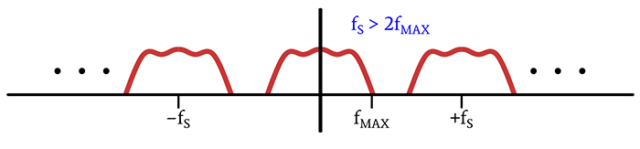
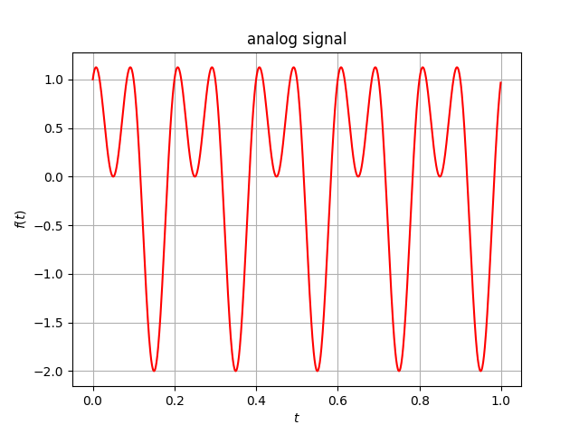
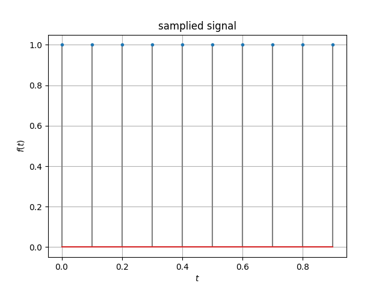
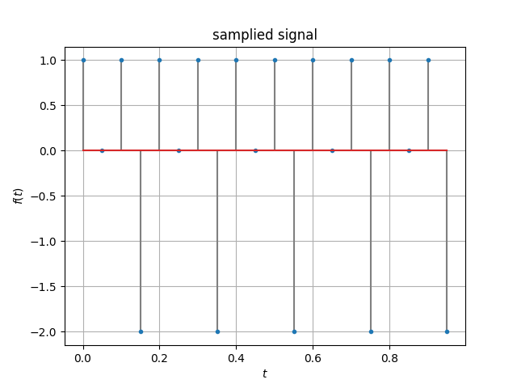
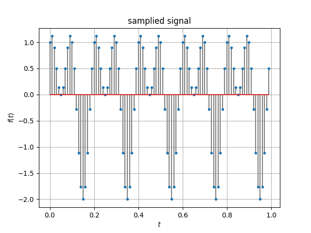
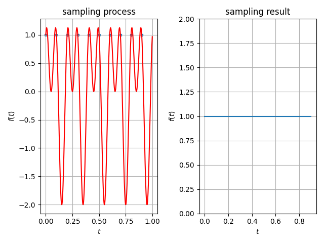
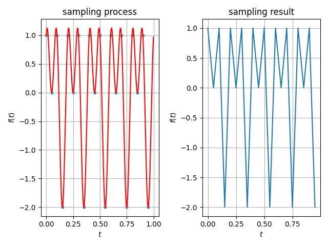
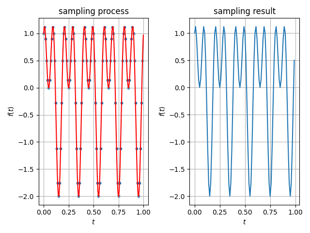
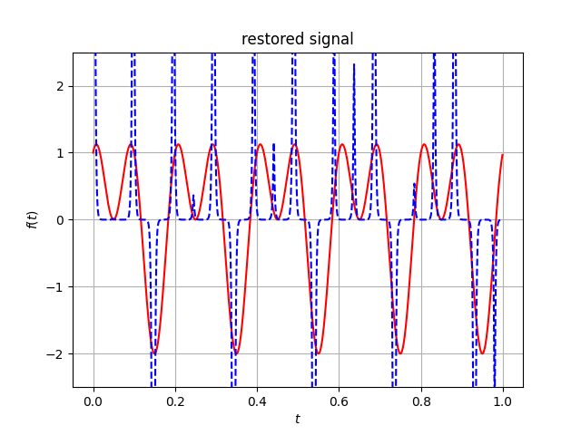
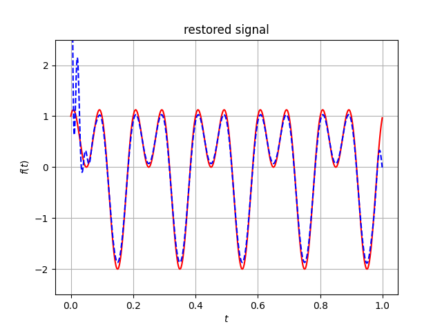

## 1. 问题描述

通过以下 3 个步骤深入理解信号的采样过程，模拟信号与离散信号的特点，时域采样定理。

1. 建立模拟信号的数学模型，设计计算机程序仿真产生模拟信号。

2. 采用过采样和欠采样多个不同的采样频率对模拟信号进行时域采样产生离散信号。

3. 绘制模拟信号和离散信号的时域波形图进行分析对比，并对采样信号信号进行恢复，绘制内插后的模拟信号。

## 2. 实验原理 

### 2.1 信号

&emsp;&emsp;信号是信息的载体，任何携带信息的物理量都可以称为信号。在社会科学、自然科学和人们的日常生活中会遇到各种和样的信号，其中有的是客观存在的，有的则是人类有目的制造的；有的信号是有用的，有的则是不需要的，甚至是有害的。虽然有不同类型的信号，但一般来说，信号都可以表示为独立自变量的函数。函数的自变量可以是时间、温度、压力等，而特定自变量所对应的函数值都可以理解为信号的幅度值。

### 2.2 模拟信号

* **连续时间(continuous-time, CT)信号**: 自变量时间在信号的定义域内是连续的。

* **模拟信号(analog signal)**: 连续信号的幅度在一定的动态范围内也连续取值，即为模拟量，这样的信号称为模拟信号。

### 2.3 离散信号

* **离散信号**: 在连续信号上采样得到的信号。与连续信号的自变量是连续的不同，离散信号是一个串行，即其自变量是“离散”的。这个串行的每一个值都可以被看作是连续信号的一个采样。由于离散信号只是采样的串行，并不能从中获得采样率，因此采样率必须另外存储。以时间为自变量的离散信号为离散时间信号。

### 2.4 采样定理

>A bandlimited continuous-time signal can be sampled and perfectly reconstructed from its samples if the waveform is sampled over twice as fast as it's highest frequency component.

&emsp;&emsp;将模拟信号变成离散时间信号，最常用的方法是对其进行等间隔采样，即每隔一个固定时间 $T​$ 取一个信号值，$T​$ 称为采样周期，$f_s=\frac{1}{T}​$ 称为采样频率，对应的角频率 $\Omega_s=\frac{2\pi}{T}=2\pi f_s​$。对于周期性的单位脉冲串，记为 $p_\delta(t)​$，称为采样脉冲信号。可以写成

$$
p_\delta(t)=\sum_{n=-\infty}^\infty\delta(t-nT)
$$

式中 $n​$ 取整数。$p_\delta(t)​$ 中每个单位冲击信号处在信号的采样点上，强度为1。$p_\delta(t)​$ 为周期信号，可用傅里叶级数展开表示

$$
p_\delta(t)=\sum_{k=-\infty}^\infty c_ke^{jk\Omega_st}
$$

式中 $\displaystyle c_k=\frac{1}{T}\int_{-\frac{T}{2}}^\frac{T}{2}p_\delta(t)e^{-jk\Omega_st}=\frac{1}{T}\int_{-\frac{T}{2}}^\frac{T}{2}\delta(t)e^{-jk\Omega_st}=\frac{1}{T}​$，故 $p_\delta(t)​$ 的傅里叶级数表示式为

$$
p_\delta(t)=\frac{1}{T}\sum_{k=-\infty}^\infty e^{jk\Omega_s t}
$$

理想采样是 $x_a(t)​$ 与 $p_\delta(t)​$ 相乘的结果，记作 $\hat{x}_a(t)​$，称为采样信号，表示为

$$
\hat{x}_a(t)=x_a(t)p_\delta(t)
$$

两边取傅里叶变换得

$$
\begin{array}{l}\hat{X}_a(j\Omega)&=&\displaystyle\int_{-\infty}^\infty\sum_{n=-\infty}^\infty x_a(t)\delta(t-nT)e^{-j\Omega t}\mathrm{d}t\\
&=&\displaystyle\int_{-\infty}^\infty x_a(t)\frac{1}{T}\sum_{k=-\infty}^\infty e^{jk\Omega_st}e^{-j\Omega t}\mathrm{d}t\\
&=&\displaystyle\frac{1}{T}\sum_{k=-\infty}^\infty\int_{-\infty}^\infty x_a(t)e^{-j(\Omega-k\Omega_s)t}\mathrm{d}t\\
&=&\displaystyle\frac{1}{T}\sum_{k=-\infty}^\infty X_a(j\Omega-jk\Omega_s)\end{array}
$$

式中，$\hat{X}_a(j\Omega)​$ 是采样信号 $\hat{x}_a(t)​$ 的频谱，$X_a(j\Omega)​$ 是模拟信号 $x_a(t)​$ 的频谱。采样信号的频谱 $\hat{X}_a(j\Omega)​$ 是原模拟信号的频谱 $X_a(j\Omega)​$ 沿频率轴，每隔一个采样角频率 $\Omega_s​$ 重复出现一次，或者说采样信号的频谱 $\hat{X}_a(j\Omega)​$ 是原模拟信号的频谱 $X_a(j\Omega)​$ 以采样频率 $\Omega_s​$ 为周期，进行周期延拓而形成的。



&emsp;&emsp;结合上面的图例，我们知道，如果满足 $\Omega_s\ge2\Omega_c​$，活着用频率表示，满足 $f_s\ge2f_c​$，则 $\hat{x}_a(t)​$ 的频谱 $\hat{X}_a(j\Omega)​$ 中，基带频谱与其周期延拓形成的频谱不重叠。设模拟信号 $x_a(t)​$ 是带限信号，最高截至频率为 $\Omega_c​$，如果采样频率 $\Omega_s\ge2\Omega_c​$，那么可以不失真的恢复原来的模拟信号，否则 $\Omega_s\lt2\Omega_c​$ 会造成信号的频谱混叠，不能无失真地恢复原来的模拟信号。能够无失真地恢复出原来模拟信号的最低采样频率称为**奈奎斯特(Nyquist)采样频率**。

### 2.5 采样内插恢复

&emsp;&emsp;如果信号的采样频率高于奈奎斯特采样频率，即信号的最高截至频率不超过折叠频率，可以让采样信号通过一个理想低通滤波器

$$
G(j\Omega)=\begin{cases} T,\quad\displaystyle|\Omega|\le\frac{\Omega_s}{2}\\0,\quad\displaystyle|\Omega|\gt\frac{\Omega_s}{2}\end{cases}
$$

采样信号 $\hat{x}_a(t)$ 的频谱为 $\hat{X}_a(j\Omega)$，则滤波器的输出频谱为

$$
Y_a(j\Omega)=\hat{X}_a(j\Omega)G(j\Omega)
$$

由于在 $|\Omega|\le\Omega_s/2$ 范围内，$\displaystyle\hat{X}_a(j\Omega)=\frac{1}{T}X_a(j\Omega)$，所以

$$
Y_a(j\Omega)=\frac{1}{T}X_a(j\Omega)G(j\Omega)=X_a(j\Omega)
$$

这就是说，在时域中低通滤波器的输出信号为 $y_a(t)=x_a(t)$，那么有

$$
\begin{array}{l}y_a(t)&=&\displaystyle\hat{x}_a(t)*g(t)\\
&=&\displaystyle\int_{-\infty}^\infty\left[\sum_{n=-\infty}^\infty x_a(\tau)\delta(t-n\tau)\right]g(t-\tau)\mathrm{d}\tau\\
&=&\displaystyle\sum_{n=-\infty}^\infty\int_{-\infty}^\infty x_a(\tau)g(t-\tau)\delta(t-nT)\mathrm{d}\tau\\
&=&\displaystyle\sum_{n=-\infty}^\infty x_a(nT)g(t-nT)\end{array}
$$

式中

$$
g(t)=\mathrm{IFT}[G(j\Omega)]=\frac{1}{2\pi}\int_{-\Omega_s/2}^{\Omega_s/2}Te^{j\Omega t}\mathrm{d}\Omega=\frac{\sin{(\pi t/T)}}{\pi t/T}=\mathrm{sinc}(\frac{t}{T})
$$

其中 $\displaystyle\mathrm{sinc}(x)=\frac{\sin{(\pi x)}}{\pi x}$，那么有

$$
x_a(t)=\sum_{n=-\infty}^\infty x_a(nT)\mathrm{sinc}(\frac{t-nT}{T})
$$

该式为**采样内插公式(Whittaker–Shannon interpolation formula)**，它表明了模拟信号 $x_a(t)$ 如何用它的采样值 $x_a(nT)$ 来表示，即 $x_a(t)$ 等于 $x_a(nT)$ 乘以对应的内插函数之和。

## 3. 实验过程

&emsp;&emsp;我们用 Python 语言进行编程实验，实验环境为 Jupyter Notebook，首先导入要用到的 Python 包

```python
import numpy as np
import pandas as pd
import matplotlib.pyplot as plt
import scipy.signal as sig
```

### 3.1 模拟信号的产生

&emsp;&emsp;我们试图用计算机产生一个简单的模拟信号作为例子，如下

$$
y(t)=\sin(2\pi f_1t)+\cos(2\pi f_2t)
$$

取 $f_1=5Hz, f_2=10Hz$，那么最高频率 $f_c=10Hz$，奈奎斯特采样频率 $f_s=20Hz$。

```python
def signal_generate():
    f1 = 5.0
    f2 = 10.0 #信号频率
    t = np.arange(0, 1.0, 0.001)
    y1 = np.sin(2*np.pi*f1*t)
    y2 = np.cos(2*np.pi*f2*t) #最高频率 fc=10, 2fc=20
    y = y1 + y2
    plt.plot(t, y, 'r') #拟合函数图像
    plt.xlabel('$t$')
    plt.ylabel('$f(t)$')
    plt.title('analog signal')
    plt.grid()
    plt.show()
    return t, y

time, signal = signal_generate()
```

得到如图所示的模拟信号图像



### 3.2 不同采样频率产生离散信号

&emsp;&emsp;根据前面的讨论，我们知道我们的实验中临界采样频率为 $f_s=20Hz$，可以分三种情况进行讨论

```python
def sampling(fs):
    sampling_point = np.arange(0, 1.0, 1.0/fs)
    sampling_signal = signal[0:1000:int(1000/fs)]
    plt.stem(sampling_point, sampling_signal, linefmt='grey', markerfmt="C0.")
    plt.xlabel('$t$')
    plt.ylabel('$f(t)$')
    plt.title('samplied signal')
    plt.grid()
    plt.show()
    return sampling_point, sampling_signal
```

取 $f_s=10Hz$，此时为 $f_s\lt2f_c$ 的情况(欠采样)

```python
sampling_point, sampling_signal = sampling(10) # 采样频率 10Hz
```



取 $f_s=20Hz$，此时为 $f_s=2f_c$ 的情况(临界)

```python
sampling_point, sampling_signal = sampling(20) # 采样频率 20Hz
```



取 $f_s=100Hz$，此时为 $f_s\gt2f_c$ 的情况(过采样)

```python
sampling_point, sampling_signal = sampling(100) # 采样频率 100Hz
```



### 3.3 采样过程波形图分析对比

&emsp;&emsp;这里我们尝试绘制采样过程的分析对比图，在原模拟信号中找到采样点，并将这些点连线，来进行对比观察。

```python
def sampling_cmp():
    plt.subplot(1, 2, 1)
    plt.plot(time, signal, 'r')
    plt.scatter(sampling_point, sampling_signal, s=10)
    plt.xlabel('$t$')
    plt.ylabel('$f(t)$')
    plt.grid()
    plt.title('sampling process')

    plt.subplot(1, 2, 2)
    plt.plot(sampling_point, sampling_signal)
    plt.xlabel('$t$')
    plt.ylabel('$f(t)$')
    plt.grid()
    plt.title('sampling result')
    plt.tight_layout()
    plt.show()

sampling_cmp()
```

* 10Hz

欠采样得到的点的连线与之前的模拟信号有较大差别。



* 20Hz

临界情况采样得到的点的连线基本能分辨出原来模拟信号的形状。



* 100Hz

在高于临界情况一定程度的过采样得到的点的连线与原来模拟信号的波形基本吻合。



### 3.4 采样信号的恢复

&emsp;&emsp;我们采用 Python 的专门用于信号处理的科学计算库 `scipy.signal` 里的函数来设计低通滤波器，由于不是理想状态，故最后只能得到接近理论的结果。

```python
def restoring(fs): # fs 应大于 2fc
    fc = 10
    sampling_y = [signal[i] if i % int(1000/fs) == 0 else 0 for i in range(0, 1000)]
    b, a = sig.iirdesign(0.08, 2*fc/fs, 1, 40)
    x = np.arange(0, 1.0, 0.001)
    y = (1000 / fs) * sig.filtfilt(b, a, sampling_y)
    plt.plot(x, signal, 'r')
    plt.plot(x, y, 'b--')
    plt.ylim(-2.5, 2.5)
    plt.xlabel('$t$')
    plt.ylabel('$f(t)$')
    plt.title('restored signal')
    plt.grid()
    plt.show()
    return y
```

* 20Hz

临界情况的采样频率不能较好地恢复原模拟信号的波形。

```python
recsig = restoring(20.0001)
```



* 100Hz

过采样时内插公式较好地恢复原模拟信号的波形，由于不是理想状态下的低通滤波器在边缘部分仍具有一些噪声。

```python
recsig = restoring(100)
```



## 4. 总结

&emsp;&emsp;通过本次实验，我们深入理解了信号的采样过程、模拟信号与离散信号的特点、时域采样定理和采样内插恢复公式。以下是我们实验中遇到的问题和解决方案。

* **杨文韬**

>问题 1: 为什么采样信号能够通过内插公式恢复，从信息论的角度来说采样会导致有效信息的丢失。<br>
&emsp;&emsp;思路: 从时域角度看，模拟信号看起来丢失了一大段，但从频域角度来看，却增加了频谱信息，采样信号的频谱是原信号频谱的周期延拓，只要满足做高频率小于采样频率的一半便能通过 $\mathrm{sinc}$ 低通滤波恢复，但完美恢复是做不到的。从另一个角度看，任何事物都不会凭空产生或消失，它只是转化成了另一种形式而存在。<br>
问题 2: 内插恢复公式很难通过编程实现或者说实现起来具有较高时间复杂度。<br>
&emsp;&emsp;思路: Python 编程语言实现的算法通常慢于其他编程语言，但 Python 的很多包都是由 C++ 实现直接调用，具有较高的效率，在 Python 中可以通过调用 `scipy.signal.iirdesign` 来设计低通滤波器，通过调用 `scipy.signal.filtfilt` 来实现低通滤波。

* **刘浩**

>问题 1: python 没有直接生成信号的方法，无法直接生成随机信号。<br>
&emsp;&emsp;解决方法：设定确定的正/余弦函数作为生成信号的代替方案生成信号。<br>
问题 2: 改变信号输入频率时，图像出现锯齿化且图像幅度不合理。<br>
&emsp;&emsp;解决方法：依据频率大小改变序列的步长，从而使图像曲线更平滑合理。<br>
问题 3: numpy 库无法绘制复杂的正/余弦信号函数。<br>
&emsp;&emsp;解决方法：将信号函数拆分成多个简单的信号的组合从而生成复杂信号.对于频率不同的信号还需要协调序列的步长从而产生足够平滑的信号。


* **周泽熙**

>问题 1: 如何进行采样?<br>
&emsp;&emsp;由于原信号是由1000个时间上等间隔点拟合而成,所以便采用切片的方式,通过控制步长实现采样频率的改变.再从幅值的列表中取出采样点对应幅值,便实现连续信号的采样。<br>
问题 2: 如何绘制离散信号的图谱?<br>
&emsp;&emsp;一开始想通过 python 中 `matlibplot.pyplot.bar` 绘制柱状图来表示离散信号,由于不能控制柱状图的宽度,导致绘制出的图很不理想.在查找 csdn 后,发现了 `matlibplot.pyplot.stem` 可专门用于绘制此类图形。
