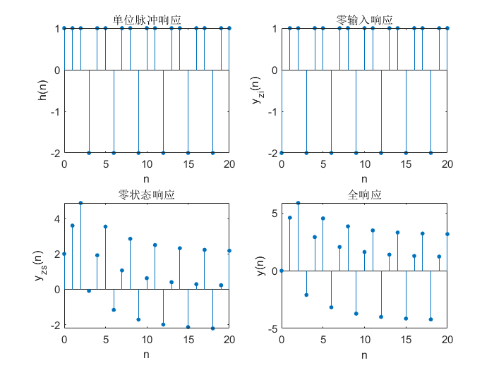

## 1. 问题描述

通过实验深刻理解离散信号与系统的时域性质和分析方法，熟练掌握利用 MATLAB 工具时域分析离散信号和系统的方法。

1. 建立线性时不变离散系统的差分方程和系统输入序列的数学模型，产生输入序列。

2. 利用 MATLAB 信号处理工具箱的差分方程求解库函数设计程序，求解系统的单位脉冲响应，给定输入序列和系统初始状态的系统响应。

3. 利用卷积计算库函数设计程序，计算给定输入序列的系统零状态响应。

## 2. 实验原理 

### 2.1 离散时间信号

&emsp;&emsp;对模拟信号 $x_a(t)$ 进行等间隔采样，设采样间隔为 $T$，则得

$$
x(t)|_{t=nT}=x_a(nT),\quad-\infty\lt n\lt\infty
$$

这里 $n$ 取整数。对于不同的 $n$ 值，$x_a(nT)$ 是一个有序的数值序列：$\cdots,x_a(-T),x_a(0),x_a(T),\cdots$，其中 $nT$ 代表前后顺序，该数值序列就是离散时间信号。

### 2.2 离散时间系统

&emsp;&emsp;离散时间系统在数学上定义为将输入序列 $x(n)$ 映射成输出序列 $y(n)$ 的唯一性变换或运算，亦即将一个序列变换成另一个序列的系统。设变换或运算关系用 $T[\cdot]$ 表示，则系统输出序列 $y(n)$ 与输入序列 $x(n)$ 之间的关系可表示为

$$
y(n)=T[x(n)]
$$

&emsp;&emsp;离散时间系统分为线性时不变系统、线性时变系统、非线性时不变系统和非线性时变系统四类。其中最重要、最常用的是线性时不变系统，这是因为很多物理过程都可用这类系统来表征，且数学上便于表示，理论上便于分析。

#### 2.2.1 线性系统

&emsp;&emsp;满足线性叠加原理的系统称为线性系统。设 $x_1(n)$ 和 $x_2(n)$ 分别为系统的输入序列，其输出序列分别用 $y_1(n)$ 和 $y_2(n)$表示，即

$$
y_1(n)=T[x_1(n)],\quad y_2(n)=T[x_2(n)]
$$

&emsp;&emsp;那么线性系统一定满足下面两个公式：

$$
T[x_1(n)+x_2(n)]=T[x_1(n)]+T[x_2(n)]\\
T[ax_1(n)]=aT[x_1(n)]
$$

以上两式分别为可加性和齐次性，式中 $a$ 为常数。将以上两个公式结合起来，线性系统一定满足

$$
y(n)=T[ax_1(n)+bx_2(n)]=aT[x_1(n)]+bT[x_2(n)]
$$

式中，$a$ 和 $b$ 均是常数。

#### 2.2.2 时不变系统

&emsp;&emsp;如果系统对输入序列的运算关系 $T[\cdot]$ 在整个运算过程中不随时间变化，则称这种系统称为时不变系统。用公式表示如下：

$$
y(n)=T[x(n)]\\
y(n-n_0)=T[x(n-n_0)]
$$

&emsp;&emsp;如果离散时间系统既是线性系统，又是时不变系统，则称其为离散时间线性时不变系统，简称为离散时间 LTI 系统。

### 2.3 离散时间 LTI 系统的时域分析

#### 2.3.1 系统的单位脉冲响应

>The impulse that is referred to in the term impulse response is generally a short-duration time-domain signal. For continuous-time systems, this is the Dirac delta function $\delta(t)$, while for discrete-time systems, the Kronecker delta function $\delta[n]$ is typically used. A system's impulse response (often annotated as $h(t)$ for continuous-time systems or $h[n]$ for discrete-time systems) is defined as the output signal that results when an impulse is applied to the system input.

&emsp;&emsp;设系统的输入为单位脉冲序列 $x(n)=\delta(n)$，系统输出 $y(n)$ 的初始状态为 0，把这种条件下的系统输出定义为系统的单位脉冲响应，用 $h(n)$ 表示。换句话说，系统的单位脉冲响应 $h(n)$ 就是系统对于单位脉冲序列 $\delta(n)$ 的零状态响应。用公式表示为

$$
h(n)=T[\delta(n)]
$$

离散时间 LTI 系统的单位脉冲响应 $h(n)=T[\delta(n)]$ 和模拟系统的单位脉冲响应 $h(t)$ 相类似，都代表系统的时域特性。

#### 2.3.2 系统输出与输入之间的关系

&emsp;&emsp;设系统的输入序列为 $x(n)$，将它表示成单位脉冲序列的移位加权和，即

$$
x(n)=\sum_{m=-\infty}^\infty x(m)\delta(n-m)
$$

那么系统的输出序列为

$$
y(n)=T[\sum_{m=-\infty}^\infty x(m)\delta(n-m)]
$$

根据线性系统的叠加原理，上式可表示为

$$
y(n)=\sum_{m=-\infty}^\infty x(m)T[\delta(n-m)]
$$

又根据时不变系统的时不变性质，最终表示为 

$$
y(n)=\sum_{m=-\infty}^\infty x(m)h(n-m)=x(n)*h(n)
$$

上式表示，离散时间 LTI 系统的输出序列等于输入序列与该系统的单位脉冲响应的线性卷积。

#### 2.3.3 系统的因果性和稳定性

&emsp;&emsp;由系统的单位脉冲响应 $h(n)$，可以判断离散时间 LTI 系统的因果性和稳定性。

&emsp;&emsp;如果系统 $n$ 时刻的输出序列，只取决于 $n$ 时刻以及 $n$ 时刻以前的输入序列，而与 $n$ 时刻以后的输入序列无关，则称该系统具有因果性质，即系统是因果系统。

&emsp;&emsp;离散时间 LTI 系统具有因果性的充分必要条件是系统的单位脉冲响应 $h(n)$ 满足

$$
h(n)=0,\quad n\lt0
$$

&emsp;&emsp;如果系统对任意的有界输入序列，其输出也是有界的序列，则称该系统是稳定系统。该定义称为 BIBO(bounded input bounded output) 稳定。

&emsp;&emsp;离散时间 LTI 系统具有稳定性的充分必要条件是系统的单位脉冲响应 $h(n)$ 满足绝对可和，即

$$
\sum_{n=-\infty}^\infty|h(n)|\lt\infty
$$

#### 2.3.4 数字滤波器的分类

1. 无限长单位脉冲响应(infinite impulse response, IIR)数字滤波器: 线性时不变离散系统的单位脉冲响应 $h(n)$ 的长度是无限的，此系统为 IIR 数字滤波器。

2. 有限长单位脉冲响应(finite impulse response, FIR)数字滤波器: 线性时不变离散系统的单位脉冲响应 $h(n)$ 的长度是有限的，此系统为 FIR 数字滤波器。

## 3. 实验过程

### 3.1 差分方程和系统输入序列

&emsp;&emsp;我们建立的离散时间系统差分方程如下

$$
y(n)+y(n-1)+y(n-2)=f(n)+2f(n-1)+3f(n-2)
$$

设定初始值为 $y(-1)=1,y(-2)=1$，输入序列 $f(n)=2(0.8)^n$，其波形如下图所示


### 3.2 求解单脉冲位响应及输出响应

&emsp;&emsp;求解单位脉冲响应即令输入序列为 $\delta(n)$，即单位脉冲响应 $h(n)=T[\delta(n)]$，在 MATLAB 中通过 `h = impz(b,a,k);` 求解。输出全响应 $y(n)$ 由零输入响应 $y_{zi}(n)$ 和零状态响应 $y_{zs}(n)$ 相加而成，零输入响应为输入序列为 0 只由初始状态影响的响应，在 MATLAB 中通过 `yzi = filter(b,a,0*f,filtic(b,a,z))` 求解，零状态响应只受输入序列影响而初始状态为 0 的响应，在 MATLAB 中通过 `yzs = filter(b,a,f);` 求解。我们通过 MATLAB 求解后绘图得到了下面的波形图。



### 3.3 利用卷积计算零状态响应

&emsp;&emsp;若输入序列为 $x(n)$，单位脉冲响应为 $h(n)$，则零状态响应为(推导见原理部分)

$$
y_c(n)=x(n)*h(n)
$$

在 MATLAB 中可以通过 `yc = conv(f, h);` 来实现，这里我们依然以 $x(n)=f(n)$ 为例来求零状态响应以便与之前的结果对比，绘制的波形图如下


### 3.4 完整代码

```matlab
% 离散信号
% 生成离散序列 f(k) = 2(0.8).^k 
c = 2;d = 0.8;k = 0:20;
f = c*d.^k;
figure
stem(k, f,'filled','MarkerSize',3)
xlabel('n');ylabel('f(n)');title('输入序列');
grid on;

% 假设差分方程 y(n)+y(n-1)+y(n-2) = f(n)+2f(n-1)+3f(n-2), 求单位脉冲响应
a = [1,1,1];
b = [1 2 3];
h = impz(b,a,k); % 单位脉冲响应
z = [1,1]; % 初始状态(y(-1)=1, y(-2)=1)
yzi = filter(b,a,0*f,filtic(b,a,z)); %零输入响应
yzs = filter(b,a,f); % 零状态响应
y = yzi + yzs; % 全响应

figure
subplot(2,2,1);
stem(k,h,'filled','MarkerSize',3);
xlabel('n');ylabel('h(n)');title('单位脉冲响应');

subplot(2,2,2);
stem(k,yzi,'filled','MarkerSize',3);
xlabel('n');ylabel('y_{zi}(n)');title('零输入响应');

subplot(2,2,3);
stem(k,yzs,'filled','MarkerSize',3);
xlabel('n');ylabel('y_{zs}(n)');title('零状态响应');

subplot(2,2,4);
stem(k,y,'filled','MarkerSize',3);
xlabel('n');ylabel('y(n)');title('全响应');

yc = conv(f, h); % 卷积求零状态响应
figure
stem(k,yc(1:21),'filled','MarkerSize',3);
xlabel('n');ylabel('y_{c}(n)');title('零状态响应');
grid on;
```

## 4. 总结

&emsp;&emsp;通过本次实验，我们深刻理解了离散信号与系统的时域性质和分析方法，熟练掌握了利用 MATLAB 工具时域分析离散信号和系统的方法。以下是我们实验中遇到的问题和解决方案。

* **杨文韬**

>问题: 为什么离散时间 LTI 系统单位脉冲响应与输入序列的卷积是零状态响应而不是全响应?<br>
&emsp;&emsp;思路: 如果系统存在初始状态，那么这个系统将不可能满足线性，也就不能在推导中使用线性系统的叠加原理，故只有零状态的系统才可能是 LTI 系统。从另一个角度来说，时域卷积，频域相乘，在频域上看，激励与系统函数相乘相当于只有激励作用于系统。

* **刘浩**

>问题 1：如何直接生成并绘制离散信号序列?<br>
&emsp;&emsp;解决方法: 直接定义离散信号生成函数后，经查阅资料得知可使用 `stem` 函数绘制离散信号。<br>
问题 2：如何求解单位脉冲响应?<br>
&emsp;&emsp;解决方法: 经查阅资料得知，可以利用 `impz` 函数传入离散系统相关参数直接求解单位脉冲响应。同时可以使用 `stem` 函数绘制相关图像。


* **周泽熙**

>问题: 如何求解零状态响应、零输入响应和全响应?<br>
&emsp;&emsp;通过查找 matlab 中有关信号处理的相关函数，发现 `filter` 函数可用于求解差分方程的三种响应，将差分方程的 2 个系数向量，输入信号以及初值导入后，便可求得响应。

